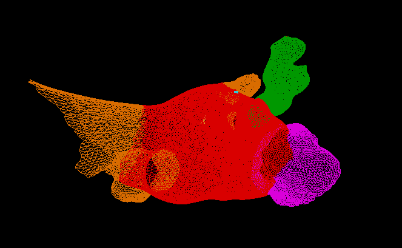

# Interative Left Atrium Tissue Mapper


<a id="selected-pics"></a>  
</img>

<a id="project-aims"></a>  

The purpose of this code is to read raw node and muscle files, allow the user to identify left atrial tissue types for use in the Left Atrial Simulator, and convert the raw files into a binary format that can be read by the simulator.

The program reads a raw left atrium model consisting of a raw node file and a raw muscle file.

---

## Raw Node File Format

The raw node file has the following format:

```text
int: Number of nodes

int: NodeID  float: Node position x  float: Node position y  float: Node position z
int: NodeID  float: Node position x  float: Node position y  float: Node position z
...
int: NodeID  float: Node position x  float: Node position y  float: Node position z
```

---

## Raw Muscle File Format

The raw muscle file has the following format:

```text
int: Number of muscles

int: MuscleID  int: First node connection  int: Second node connection
int: MuscleID  int: First node connection  int: Second node connection
...
int: MuscleID  int: First node connection  int: Second node connection
```

---

## Loading the Model

The user must specify the name of the raw file in the startup file.

The node structures are loaded along with the muscles connected to them. The natural lengths of the muscles are calculated and stored in their corresponding muscle structures.

The `PulsePointNode` is initialized as node `0`. Its tissue type, along with the tissue types of its attached muscles, is set to **Bachmann's Bundle**. All remaining nodes and muscles are initialized as standard left atrial (LA) tissue.

These assignments can be changed later through the user interface, but they are initialized in this manner so that the user can immediately generate a model consisting entirely of standard LA tissue with a simple `PulsePointNode`.

---

## Assigning Tissue Types

The user can select the `PulsePointNode` and choose tissue types from the drop-down menu on the right side of the interface.

A sphere attached to the mouse cursor is used to assign tissue types to nodes:

* **Left Click** – Assign the selected tissue type to nodes and attached muscles.
* **Right Click** – Reset nodes and muscles to standard LA tissue.

The currently available tissue types are:

* Bachmann's Bundle
* Pulmonary Vein
* Back Wall
* Mitral Valve
* Left Atrial Appendage
* Scar Tissue
* Extra Tissue

---

## Muscle Tissue Assignment Rules

Muscles are assigned tissue types based on the node types they connect.

If a muscle connects two nodes with different tissue types, the muscle is assigned the tissue type that appears earlier in the following priority list:

1. Bachmann's Bundle
2. Pulmonary Vein
3. Back Wall
4. Mitral Valve
5. Left Atrial Appendage
6. Scar Tissue
7. Extra Tissue

---

## PulsePointNode Behavior

The `PulsePointNode` is always assigned the **Bachmann's Bundle** tissue type.

If the `PulsePointNode` is changed during the annotation process:

1. The previous `PulsePointNode` is reset to standard LA tissue.
2. The newly selected node is assigned the Bachmann's Bundle tissue type.
3. All affected muscles are updated accordingly.

---

## Saving the Binary File

Once all desired tissue types have been assigned, click **Save Binary**.

The node and muscle structures are saved to a timestamped binary file to prevent previously saved files from being overwritten.

---

## Editing Existing Binary Files

The user may modify as much or as little of the model as desired.

To make additional changes to a previously modified model:

1. Specify the saved binary file in the startup file.
2. Run the program again.
3. Make any desired modifications.
4. Click **Save Binary**.

All previous modifications will be preserved. A new timestamped binary file will be created when the model is saved, ensuring that the original file is not overwritten.

#### Disclosure: This simulation only works on Linux-based distros. All development and testing was done in Ubuntu.

  Install Nvidia CUDA Toolkit:

	sudo apt update
    sudo apt install nvidia-cuda-toolkit

 If your screens are not getting recognized, you may try this and reboot:

	sudo apt update
	sudo apt install --reinstall nvidia-drivers-595-open
	sudo reboot

  Install Mesa Utils:

	sudo apt update
    sudo apt install mesa-utils

  Install gcc and nvcc:

    sudo apt update
	sudo apt install build-essential

  Install GLFW:

    sudo apt update
	sudo apt install libglfw3-dev libglu1-mesa-dev freeglut3-dev mesa-common-dev
	
  Install X11-related libraries:

    sudo apt update
	sudo apt install libxinerama-dev libxcursor-dev libxi-dev
	
  Install gedit:
  
    sudo apt update
	sudo apt install gedit

  Install ffmpeg:
  
    sudo apt update
	sudo apt install ffmpeg


<a id="building-and-running"></a>    
## Building and Running

### Building (Note: this must be done after every code change)

  Navigate to the cloned folder and run the following command to build and compile the simulation:

    ./compile

  If it says that you do not have permissions, run the following command and try again.

  	chmod +x compile

### Running
  After compiling, run the simulation:

    ./run

<a id="simulation-setup-file"></a>    
## Simulation Setup Files 
	There are three simulation setup files. 
	These files can be adjusted by the user before running a simulation to set up the basic framework of the run.
	All units used in the simulation are as follows:
   	Length is in millimeters (mm)
   	Time is in milliseconds (ms)
   	Mass is in grams (g)
   
### SetupLAMapping
   	This file is read at startup and tells the program what NodesAndMuscle file to read and several view settings.
	
<a id="license"></a>
## License
  - This code is protected by the MIT License and is free to use for personal and academic use.

<a id="contributing-authors"></a>
## Contributing Authors
  - Mason Bane
  - Bryant Wyatt (PI)

<a id="funding-sources"></a>  
## Funding Sources
This research was supported by the National Institutes of Health (NIH) grant #1R15HL179671-01, 
the NVIDIA corporation’s Applied Research Accelerator Program. 
Student support was provided by the Bill and Winnie Wyatt Foundation.

<a id="acknowledgements"></a>
## Acknowledgements
We would like to thank Tarleton State University’s Mathematics Department for use of
their High-Performance Computing lab for the duration of this project.


The Particle Modeling Group reserves the right to change this policy at any time.
